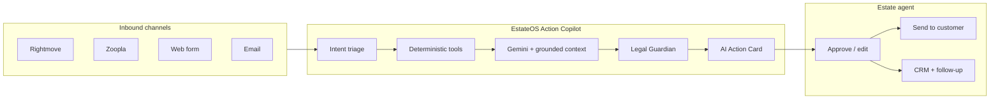
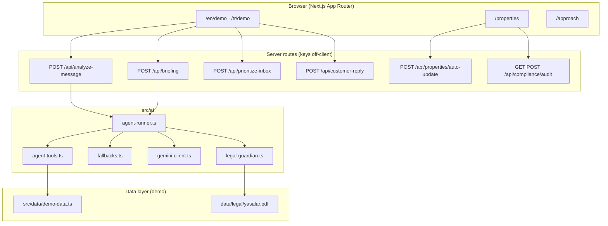
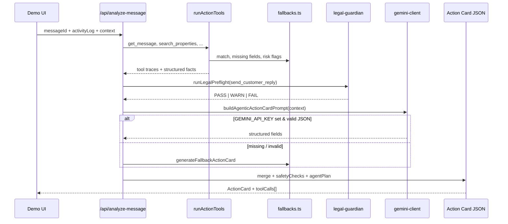
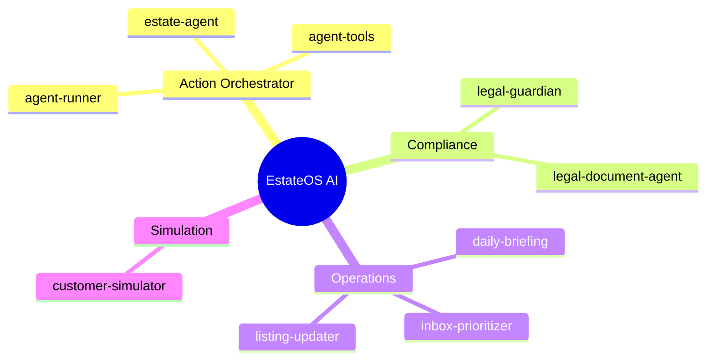
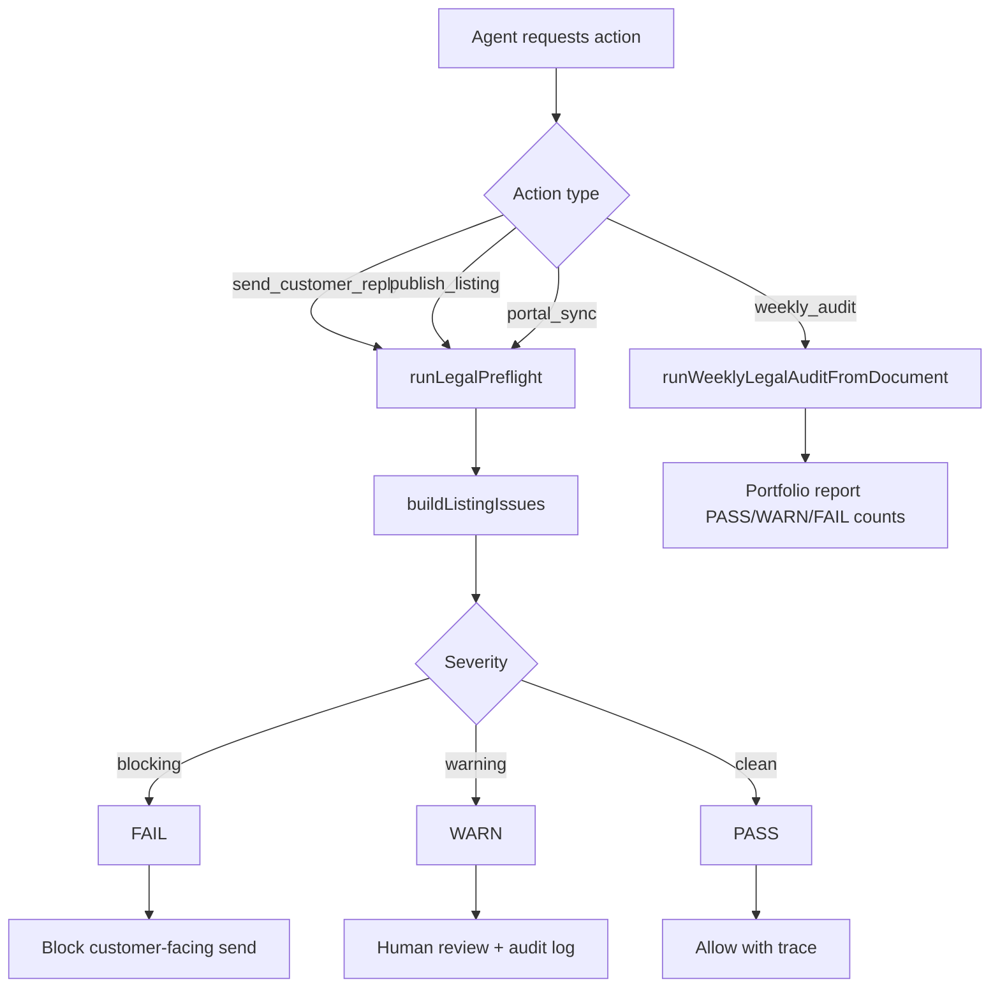
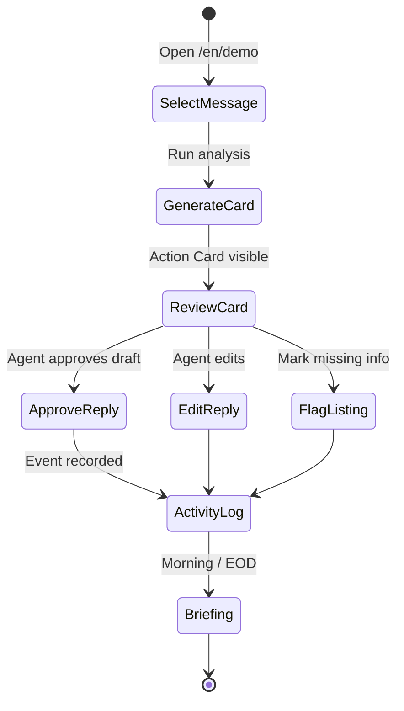
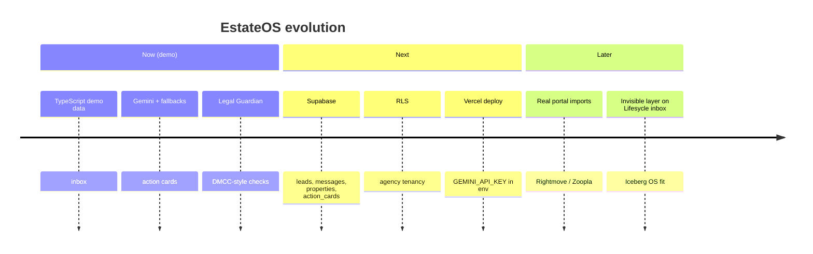

<p align="center">
  
</p>

<p align="center">
  <strong>AI action layer for UK estate agents ,  not a chatbot, not a CRM replacement.</strong>
</p>

<p align="center">
  <a href="https://iceberg-digital.co.uk/">Iceberg Digital</a> ·
  Mini case prototype ·
  <a href="./proje.md">Product spec (TR)</a> ·
  EN / TR UI
</p>

<p align="center">
  
  
  
  
</p>

---

## Table of contents

- [TL;DR](#tldr)
- [Mini case context](#mini-case-context)
- [The problem in numbers](#the-problem-in-numbers)
- [What EstateOS does](#what-estateos-does)
- [What it is not](#what-it-is-not)
- [System architecture](#system-architecture)
- [Agentic pipeline](#agentic-pipeline)
- [Deterministic tools](#deterministic-tools)
- [Specialised agents](#specialised-agents)
- [Legal Guardian & compliance](#legal-guardian--compliance)
- [API surface](#api-surface)
- [Demo workflow](#demo-workflow)
- [Project structure](#project-structure)
- [Local setup](#local-setup)
- [Environment variables](#environment-variables)
- [Fallback mode](#fallback-mode)
- [Internationalisation](#internationalisation)
- [Roadmap](#roadmap)
- [Documentation](#documentation)
- [Türkçe](#türkçe)

---

## TL;DR

**EstateOS Action Copilot** turns every inbound customer message into a **verified next-best-action card**: intent, matched listing, missing material information, risk flags, DMCC-aware reply draft, CRM note, follow-up task and listing action.

The agent **always approves** before anything is customer-facing. AI runs on **retrieved CRM facts** (RAG-style grounding), not open-ended chat.

```bash
npm install && npm run dev
# → http://localhost:3000/en/demo
```

---

## Mini case context

This repository is a **working prototype** built for the [Iceberg Digital](https://iceberg-digital.co.uk/) hiring mini case:

> *Design a small but useful AI feature that helps a UK estate agent handle customer messages, listing updates and follow-ups during the day.*

Iceberg positions itself as an **AI Operating System for estate agents** ,  replacing passive CRMs with continuous intelligence ([Lifesycle](https://iceberg-digital.co.uk/), Predict, Neuron, Uzair). **EstateOS Action Copilot** is the **inbox action layer** in that vision: it does not replace Lifesycle; it shows how unstructured portal/email traffic becomes **structured, qualified, compliance-checked CRM actions** before a human sends anything.

Full product narrative: [`proje.md`](./proje.md) · Quantified approach: `/en/approach` and `/tr/approach` (after `npm run dev`).

---

## The problem in numbers

Industry baselines used in the approach page (case-study assumptions):

| Area | Statistic | Why it matters |
|------|-----------|----------------|
| Sector leakage | **£119m/yr** (UK-wide) | Missed enquiries compound into nine-figure loss |
| DMCC 2024 penalties | Up to **10% of global turnover** | Misleading omission / drip pricing ,  not fixed fines |
| Live listing gaps | **33%** missing council tax · **25%** missing lease length | Part A material information still incomplete when published |
| App switching | **566** switches/agent/day · up to **40%** productivity loss | Context switching between inbox, CRM, portals |
| Speed-to-lead | **80%** of valuations → first responder | Response latency is zero-sum for instructions |
| Missed calls | **5–10** per branch/week | Ghosting converts to lost viewings/valuations |
| Task automation headroom | **179** tasks/transaction · **~61%** automatable (110) | Admin drag is quantifiable |
| Rental → sales | **9.8% → 15.6%** YoY | Hidden valuation signals in tenant/buyer threads |

---

## What EstateOS does



### Core capabilities (demo)

| Feature | Description |
|---------|-------------|
| **Demo inbox** | Four realistic UK lead scenarios (Colchester flat, valuation, under-offer, etc.) |
| **AI Action Card** | Intent, lead temperature, property match, confidence breakdown, risk flags |
| **Material information** | Part A/B/C-style gaps (parking, EPC, council tax, lease length, stale availability) |
| **Legal Guardian** | PASS / WARN / FAIL before publish, portal sync or customer reply |
| **Morning brief & EOD recap** | Priorities from real activity log ,  not generic AI fluff |
| **Inbox prioritisation** | Hot/warm/cold scoring on new conversation signals |
| **Customer simulator** | Test agent drafts against simulated customer replies |
| **Listing auto-update** | Extract structured field changes from free-text landlord notes |
| **Compliance audit** | Weekly-style batch check across all demo listings + optional `data/legal/yasalar.pdf` |
| **EN / TR** | Full UI localisation + approach page with statistical framing |
| **Dark / light** | Theme via `next-themes` design tokens |

---

## What it is not

| Not this | Because |
|----------|---------|
| Open chatbot | UI is a **Data Triage Panel** ,  structured cards, not free-text bubbles |
| Full CRM | No multi-branch auth, no real Rightmove/Zoopla sync in MVP |
| Auto-send | **Human-in-the-loop** is mandatory for customer-facing output |
| LangGraph / heavy agent framework | Deliberate **TypeScript pipeline** for readability in a mini case ([`proje.md` §17](./proje.md)) |

---

## System architecture



**Design principle:** deterministic tools run **first** and produce traces; Gemini only **narrates and drafts** inside that evidence boundary.

---

## Agentic pipeline

There is no separate “agent runtime”. The **orchestrator** is `generateAgenticActionCard` in [`src/ai/agent-runner.ts`](./src/ai/agent-runner.ts):



### Action card output (conceptual)

```json
{
  "intent": ["viewing_request", "availability_question", "parking_question"],
  "customerType": "tenant",
  "leadTemperature": "hot",
  "confidence": 0.86,
  "missingFields": ["parking_info"],
  "riskFlags": [{ "code": "parking_info_missing" }, { "code": "availability_may_be_stale" }],
  "suggestedReply": "…verification language only…",
  "legalGuardDecision": { "status": "WARN", "issues": [] },
  "toolCalls": [{ "name": "check_listing_completeness", "status": "success" }],
  "requiresHumanApproval": true
}
```

Reference scenario: **Colchester 2-bed flat** ,  hot tenant lead, parking missing, cautious reply (no invented parking).

---

## Deterministic tools

Tools are plain TypeScript functions in [`src/ai/agent-tools.ts`](./src/ai/agent-tools.ts). Each returns an **`AgentToolCall` trace** shown in the UI.

### Action-card tool chain

| Tool | Input | Output |
|------|--------|--------|
| `get_message` | `messageId` | Localised inbound message |
| `get_lead_profile` | `messageId` | Archetype, urgency, objections, memory |
| `search_properties` | message text | Ranked candidates with scores |
| `check_listing_completeness` | `propertyId` | Missing field keys (EPC, parking, council tax, …) |
| `check_stale_availability` | `propertyId` | `true` if `lastUpdatedHoursAgo > 24` |
| `get_activity_log` | `messageId?` | Scoped operational events |
| `create_crm_note_draft` | message + property | CRM note string |
| `create_follow_up_draft` | message + gaps | Follow-up task string |

`runActionTools()` executes the full chain in order; [`fallbacks.ts`](./src/ai/fallbacks.ts) implements matching, intent extraction and risk rules.

### Briefing tool chain

| Tool | Purpose |
|------|---------|
| `get_active_leads` | All demo inbox messages |
| `check_all_listing_completeness` | Portfolio-wide missing-field scan |
| `check_stale_availability_batch` | 24h threshold batch |
| `summarise_operational_activity` | EOD ledger from real user actions |
| `generate_daily_priorities` | Unresolved signals for morning/EOD |

EOD briefings **reject** ungrounded Gemini output when the activity log has real events but the model ignores touched leads ([`isGroundedEodBriefing`](./src/ai/agent-runner.ts)).

---

## Specialised agents

Lightweight modules ,  each with Gemini + deterministic fallback:



| Module | File | Role |
|--------|------|------|
| **Action orchestrator** | `agent-runner.ts` | Tool chain → Legal Guardian → Gemini merge → Action Card |
| **Legal Guardian** | `legal-guardian.ts` | DMCC / material information preflight per listing action |
| **Legal document agent** | `legal-document-agent.ts` | Extract rules from `data/legal/yasalar.pdf` or `.txt` via Gemini PDF |
| **Daily briefing** | `daily-briefing.ts` → `generateAgenticBriefing` | Morning priorities & EOD recap |
| **Inbox prioritiser** | `inbox-prioritizer.ts` | Conversation-level hot/warm/cold scores |
| **Listing updater** | `listing-updater.ts` | Parse landlord text → structured listing diff |
| **Customer simulator** | `customer-simulator.ts` | Realistic tenant/buyer replies for draft testing |
| **Prompts & context** | `prompts.ts`, `public-context.ts` | Sanitised CRM facts only ,  no raw secrets in prompts |

---

## Legal Guardian & compliance



- **Law basis:** DMCC Act 2024 unfair commercial practices + UK material information guidance ([`legal-guardian.ts`](./src/ai/legal-guardian.ts)).
- **Blocking actions:** `publish_listing`, `portal_sync`, `send_customer_reply`.
- **Event-driven model:** Compliance fires on operational events (message received, card generated, reply approved, etc.) ,  see `/en/approach` or `/tr/approach`.

Optional legal corpus: place **`data/legal/yasalar.pdf`** (or `yasalar.txt`) ,  rules merge with built-in NTSELAT-style field checks.

---

## API surface

| Method | Route | Body / query | Returns |
|--------|-------|--------------|---------|
| `POST` | `/api/analyze-message` | `{ messageId, activityLog?, supplementalContext?, locale? }` | `ActionCard` |
| `POST` | `/api/briefing` | `{ type: "morning" \| "eod", activityLog?, locale? }` | `Briefing` |
| `POST` | `/api/prioritize-inbox` | `{ items[], locale? }` | `ConversationAiInsight[]` |
| `POST` | `/api/customer-reply` | chat history + agent draft | Simulated customer message |
| `POST` | `/api/properties/auto-update` | `{ propertyId, inputText, locale? }` | `ListingUpdateDraft` |
| `GET` / `POST` | `/api/compliance/audit` | `locale`, optional `properties[]` | `LegalAuditReport` |

All AI keys stay **server-side**. Client never receives `GEMINI_API_KEY`.

---

## Demo workflow



**Agent actions in UI** (stored in client activity log): approve reply, edit reply, create follow-up, save CRM note, mark listing missing info, send simulated customer message, generate briefing.

---

## Project structure

```text
iceberg/
├── app/
│   ├── [locale]/          # en | tr routes
│   │   ├── demo/          # Main product demo
│   │   ├── properties/    # Listings + compliance audit
│   │   └── approach/      # Mini case + statistics
│   └── api/               # Server AI endpoints
├── components/
│   ├── demo-dashboard.tsx # Inbox + action card UI
│   └── ui.tsx             # Design system primitives
├── src/
│   ├── ai/                # Agents, tools, legal, prompts
│   ├── data/demo-data.ts  # Messages, properties, profiles
│   ├── i18n/              # EN / TR dictionaries
│   └── types/             # Shared TypeScript contracts
├── data/legal/            # Optional yasalar.pdf / .txt
├── public/brand/          # estateos-logo.png
├── proje.md               # Full product specification (TR)
└── DESIGN_LANGUAGE.md     # Visual tokens
```

---

## Local setup

**Requirements:** Node.js 18+ (20 recommended), npm.

```bash
git clone <repo-url>
cd iceberg
npm install
npm run dev
```

| Route | URL |
|-------|-----|
| Landing | http://localhost:3000/en |
| **Demo** | http://localhost:3000/en/demo |
| Properties | http://localhost:3000/en/properties |
| Approach | http://localhost:3000/en/approach |
| Turkish demo | http://localhost:3000/tr/demo |

Production build:

```bash
npm run build
npm start
```

Deploy target: **Vercel** (App Router compatible).

---

## Environment variables

Create `.env.local`:

```env
GEMINI_API_KEY=your_google_ai_studio_key
```

| Variable | Required | Effect |
|----------|----------|--------|
| `GEMINI_API_KEY` | No | Enables Gemini for action cards, briefings, inbox AI, customer sim, listing update, legal PDF extraction |

Without the key, **deterministic fallbacks** keep every demo path functional.

---

## Fallback mode

| Scenario | Behaviour |
|----------|-----------|
| No API key | `source: "fallback"` on cards and briefings |
| Invalid JSON from Gemini | Same ,  merge skips model fields |
| EOD briefing not grounded in activity | Gemini output discarded for EOD |
| Legal PDF present, no key | Built-in material checks only |

The Colchester message always demonstrates: multi-intent extraction, **0.86** confidence, parking gap, stale availability flag, safe reply wording.

---

## Internationalisation

- Locales: **`en`** · **`tr`**
- Dictionaries: [`src/i18n/dictionaries/`](./src/i18n/dictionaries/)
- Demo data supports per-locale overrides on messages and properties
- Approach page: full statistical content in both languages

---

## Roadmap

Planned production evolution ([`proje.md`](./proje.md)):



**Supabase tables (planned):** `leads`, `messages`, `properties`, `action_cards`, `briefings`, audit events.

---

## Documentation

| Document | Description |
|----------|-------------|
| [`proje.md`](./proje.md) | Full mini case spec, user flows, AI prompts, Iceberg alignment |
| [`DESIGN_LANGUAGE.md`](./DESIGN_LANGUAGE.md) | Colours, typography, playful surfaces |
| [`data/legal/README.md`](./data/legal/README.md) | Legal corpus setup |
| **Approach page** | Live statistical framing at `/en/approach` and `/tr/approach` |

---

## Türkçe

Tam Türkçe README: **[README.tr.md](./README.tr.md)**

---

<p align="center">
  
  <br />
  <sub>Mini case prototype for <a href="https://iceberg-digital.co.uk/">Iceberg Digital</a> ,  AI Operating System for Estate Agents</sub>
</p>
