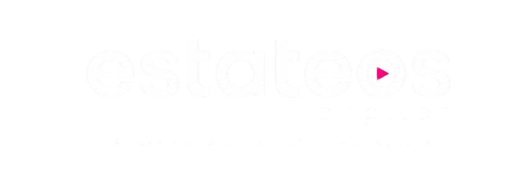
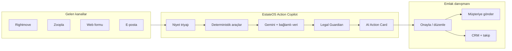
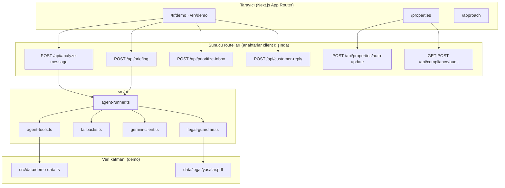
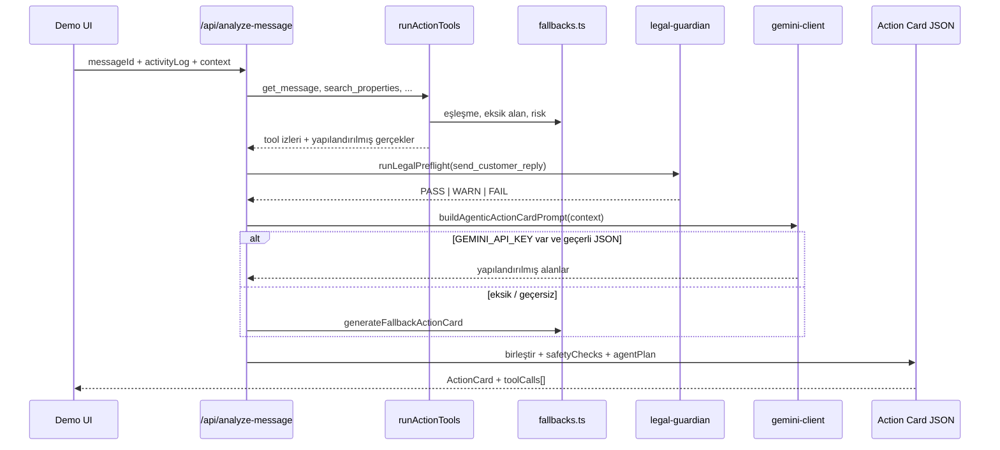
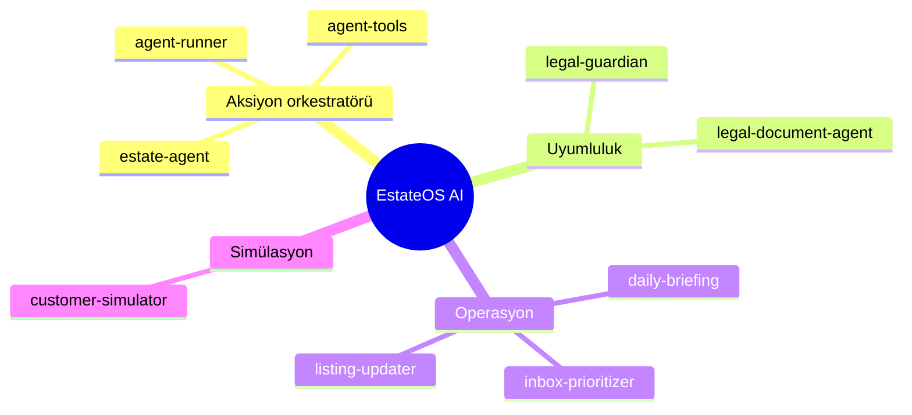
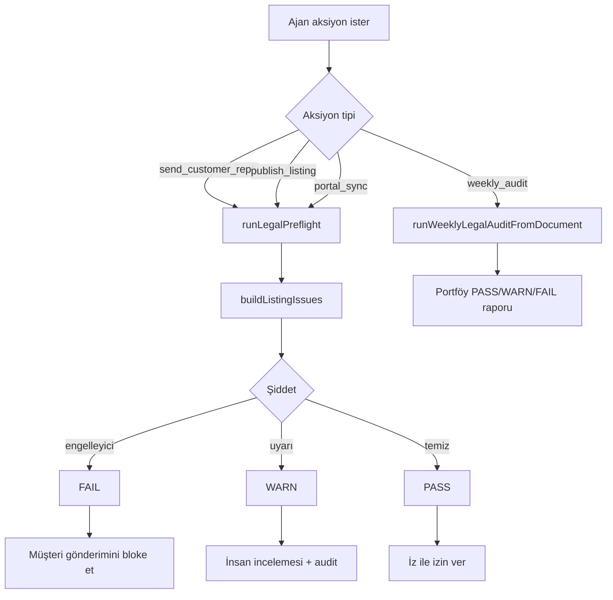
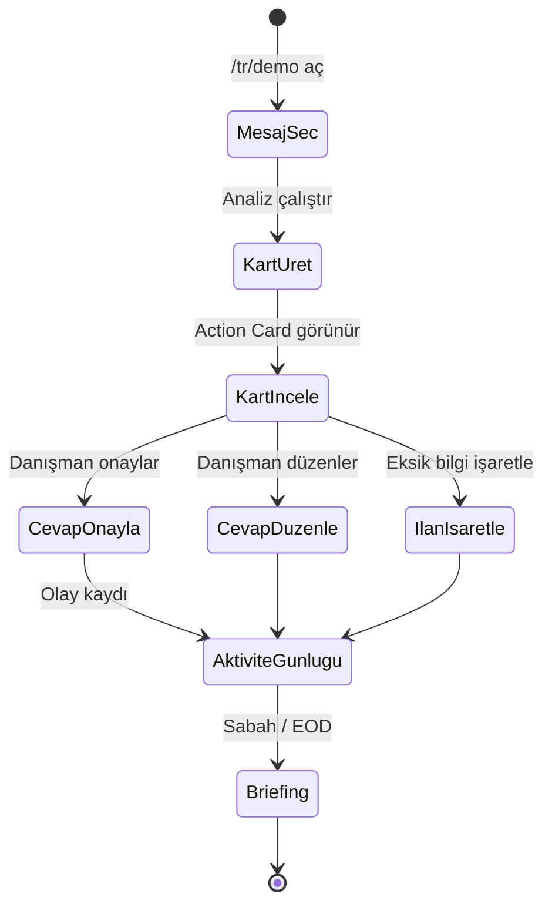
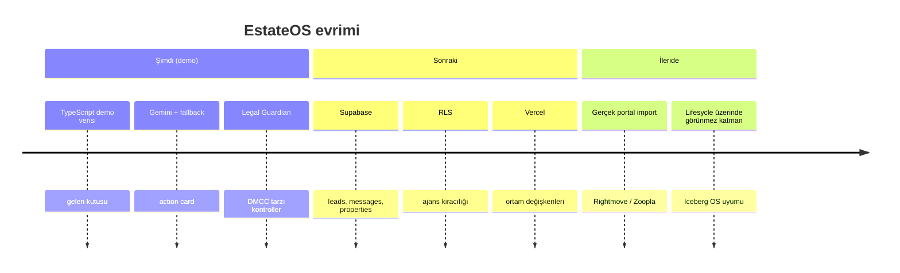
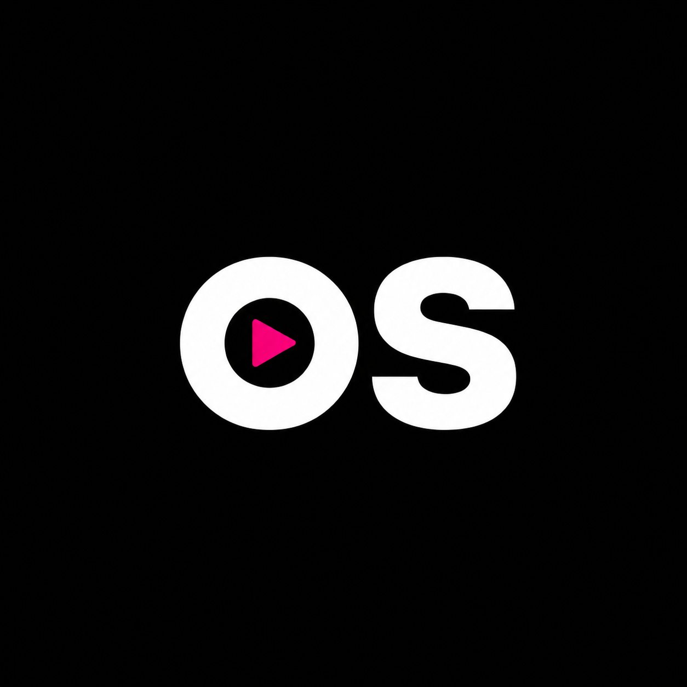

<p align="center">
  
</p>

<p align="center">
  <strong>UK emlak danışmanları için AI aksiyon katmanı ,  chatbot değil, CRM yerine geçmez.</strong>
</p>

<p align="center">
  <a href="https://iceberg-digital.co.uk/">Iceberg Digital</a> ·
  Mini case prototipi ·
  <a href="./proje.md">Ürün spesifikasyonu</a> ·
  TR / EN arayüz
</p>

<p align="center">
  
  
  
  
</p>

---

## İçindekiler

- [Özet](#özet)
- [Mini case bağlamı](#mini-case-bağlamı)
- [Problem rakamlarla](#problem-rakamlarla)
- [EstateOS ne yapar](#estateos-ne-yapar)
- [Ne değildir](#ne-değildir)
- [Sistem mimarisi](#sistem-mimarisi)
- [Agentic pipeline](#agentic-pipeline)
- [Deterministik araçlar](#deterministik-araçlar)
- [Özelleşmiş ajanlar](#özelleşmiş-ajanlar)
- [Legal Guardian ve uyumluluk](#legal-guardian-ve-uyumluluk)
- [API yüzeyi](#api-yüzeyi)
- [Demo iş akışı](#demo-iş-akışı)
- [Proje yapısı](#proje-yapısı)
- [Yerel kurulum](#yerel-kurulum)
- [Ortam değişkenleri](#ortam-değişkenleri)
- [Fallback modu](#fallback-modu)
- [Çok dilli destek](#çok-dilli-destek)
- [Yol haritası](#yol-haritası)
- [Dokümantasyon](#dokümantasyon)
- [English](#english)

---

## Özet

**EstateOS Action Copilot**, gelen her müşteri mesajını **doğrulanmış bir sonraki aksiyon kartına** dönüştürür: niyet, eşleşen ilan, eksik material information, risk bayrakları, DMCC uyumlu cevap taslağı, CRM notu, follow-up görevi ve ilan aksiyonu.

Danışman müşteriye gidecek hiçbir şeyi **onaylamadan** göndermez. AI, açık uçlu sohbet yerine **CRM’den çekilen doğrulanmış verilerle** (RAG mantığı) çalışır.

```bash
npm install && npm run dev
# → http://localhost:3000/tr/demo
```

---

## Mini case bağlamı

Bu depo, [Iceberg Digital](https://iceberg-digital.co.uk/) işe alım mini case’i için geliştirilmiş **çalışan bir prototiptir**:

> *UK emlak danışmanının gün içindeki müşteri mesajları, ilan güncellemeleri ve takiplerini kolaylaştıracak küçük ama faydalı bir AI özelliği tasarlayın.*

Iceberg kendini emlakçılar için **AI İşletim Sistemi** olarak konumlar ,  pasif CRM’lerin yerine sürekli çalışan zeka ([Lifesycle](https://iceberg-digital.co.uk/), Predict, Neuron, Uzair). **EstateOS Action Copilot**, bu vizyondaki **gelen kutusu aksiyon katmanıdır**: Lifesycle’ın yerini almaz; portal/e-posta kaosunun **yapılandırılmış, nitelikli, uyum kontrollü CRM aksiyonlarına** nasıl dönüştüğünü gösterir.

Tam ürün anlatısı: [`proje.md`](./proje.md) · Sayısal yaklaşım: `/tr/approach` ve `/en/approach` (`npm run dev` sonrası).

---

## Problem rakamlarla

Yaklaşım sayfasında kullanılan sektör taban çizgileri (case-study varsayımları):

| Alan | İstatistik | Neden önemli |
|------|------------|----------------|
| Sektör sızıntısı | **£119m/yıl** (UK geneli) | Kaçırılan talepler dokuz haneli kayba birikir |
| DMCC 2024 cezaları | Global cironun **%10’una kadar** | Yanıltıcı ihmal / drip pricing ,  sabit ceza değil |
| Yayında ilan boşlukları | **%33** council tax · **%25** lease length eksik | Part A hâlâ eksik yayınlanıyor |
| Uygulama geçişi | **566** geçiş/gün · **%40’a** kadar verim kaybı | Inbox, CRM, portal arası bağlam kaybı |
| Hızlı dönüş | Valuation randevularının **%80’i** ilk dönene | Instruction için sıfır toplamlı yarış |
| Kaçırılan çağrılar | Şube başı **5–10**/hafta | Ghosting → kayıp viewing/valuation |
| Otomasyon payı | **179** görev/işlem · **~%61** (110) | İdari yük ölçülebilir |
| Kira → satış | **%9,8 → %15,6** (yıllık) | Kiracı/alıcı konuşmalarında gizli valuation |

---

## EstateOS ne yapar



### Temel yetenekler (demo)

| Özellik | Açıklama |
|---------|----------|
| **Demo gelen kutusu** | Dört gerçekçi UK lead senaryosu (Colchester daire, valuation, under-offer vb.) |
| **AI Action Card** | Niyet, lead sıcaklığı, ilan eşleşmesi, güven dökümü, risk bayrakları |
| **Material information** | Part A/B/C tarzı boşluklar (otopark, EPC, council tax, kira süresi, eski müsaitlik) |
| **Legal Guardian** | Yayın, portal sync veya müşteri cevabı öncesi PASS / WARN / FAIL |
| **Sabah brief & gün sonu** | Gerçek aktivite günlüğünden öncelikler ,  jenerik AI metni değil |
| **Gelen kutusu önceliği** | Yeni mesaj sinyallerine göre hot/warm/cold skoru |
| **Müşteri simülatörü** | Taslak cevapları simüle müşteriyle test etme |
| **İlan otomatik güncelleme** | Serbest metin landlord notundan yapılandırılmış alan değişikliği |
| **Uyumluluk denetimi** | Tüm demo ilanları + isteğe bağlı `data/legal/yasalar.pdf` |
| **TR / EN** | Tam arayüz yerelleştirmesi + istatistiksel yaklaşım sayfası |
| **Koyu / açık tema** | `next-themes` tasarım token’ları |

---

## Ne değildir

| Bu değil | Çünkü |
|----------|--------|
| Açık chatbot | Arayüz **Veri Triyaj Paneli** ,  yapılandırılmış kartlar |
| Tam CRM | MVP’de gerçek Rightmove/Zoopla sync yok |
| Otomatik gönderim | Müşteri çıktısı için **insan onayı zorunlu** |
| LangGraph / ağır agent framework | Mini case için bilinçli **TypeScript pipeline** ([`proje.md` §17](./proje.md)) |

---

## Sistem mimarisi



**Tasarım ilkesi:** Deterministik araçlar **önce** çalışır ve iz üretir; Gemini yalnızca bu kanıt sınırı içinde **anlatır ve taslak yazar**.

---

## Agentic pipeline

Ayrı bir “agent runtime” yok. **Orkestratör:** [`src/ai/agent-runner.ts`](./src/ai/agent-runner.ts) içindeki `generateAgenticActionCard`:



### Action Card çıktısı (kavramsal)

```json
{
  "intent": ["viewing_request", "availability_question", "parking_question"],
  "customerType": "tenant",
  "leadTemperature": "hot",
  "confidence": 0.86,
  "missingFields": ["parking_info"],
  "riskFlags": [{ "code": "parking_info_missing" }, { "code": "availability_may_be_stale" }],
  "suggestedReply": "…yalnızca doğrulama dili…",
  "legalGuardDecision": { "status": "WARN", "issues": [] },
  "toolCalls": [{ "name": "check_listing_completeness", "status": "success" }],
  "requiresHumanApproval": true
}
```

Referans senaryo: **Colchester 2 yatak daire** ,  sıcak kiracı, otopark eksik, güvenli cevap (uydurulmuş otopark yok).

---

## Deterministik araçlar

Araçlar [`src/ai/agent-tools.ts`](./src/ai/agent-tools.ts) içinde düz TypeScript fonksiyonlarıdır. Her biri UI’da gösterilen **`AgentToolCall` izi** döndürür.

### Action Card araç zinciri

| Araç | Girdi | Çıktı |
|------|-------|-------|
| `get_message` | `messageId` | Yerelleştirilmiş gelen mesaj |
| `get_lead_profile` | `messageId` | Arketip, aciliyet, itirazlar, hafıza |
| `search_properties` | mesaj metni | Skorlu aday ilanlar |
| `check_listing_completeness` | `propertyId` | Eksik alan anahtarları |
| `check_stale_availability` | `propertyId` | `lastUpdatedHoursAgo > 24` ise true |
| `get_activity_log` | `messageId?` | Operasyonel olaylar |
| `create_crm_note_draft` | mesaj + ilan | CRM notu metni |
| `create_follow_up_draft` | mesaj + boşluklar | Follow-up metni |

`runActionTools()` zinciri sırayla çalıştırır; eşleştirme ve risk kuralları [`fallbacks.ts`](./src/ai/fallbacks.ts) içindedir.

### Briefing araç zinciri

| Araç | Amaç |
|------|------|
| `get_active_leads` | Tüm demo mesajları |
| `check_all_listing_completeness` | Portföy geneli eksik alan taraması |
| `check_stale_availability_batch` | 24 saat eşiği toplu kontrol |
| `summarise_operational_activity` | Gerçek kullanıcı aksiyonlarından EOD defteri |
| `generate_daily_priorities` | Sabah/EOD için çözülmemiş sinyaller |

EOD brief’leri, aktivite günlüğünde gerçek olay varken model lead’leri yok sayarsa Gemini çıktısı **reddedilir**.

---

## Özelleşmiş ajanlar

Her biri Gemini + deterministik fallback içeren hafif modüller:



| Modül | Dosya | Rol |
|-------|-------|-----|
| **Aksiyon orkestratörü** | `agent-runner.ts` | Araç zinciri → Legal Guardian → Gemini birleştirme |
| **Legal Guardian** | `legal-guardian.ts` | DMCC / material information ön kontrolü |
| **Yasal belge ajanı** | `legal-document-agent.ts` | `data/legal/yasalar.pdf` veya `.txt` kural çıkarımı |
| **Günlük briefing** | `daily-briefing.ts` | Sabah öncelikleri ve gün sonu özeti |
| **Gelen kutusu önceliklendirici** | `inbox-prioritizer.ts` | Konuşma bazlı hot/warm/cold |
| **İlan güncelleyici** | `listing-updater.ts` | Serbest metin → yapılandırılmış ilan diff |
| **Müşteri simülatörü** | `customer-simulator.ts` | Taslak test için gerçekçi müşteri cevapları |
| **Prompt ve bağlam** | `prompts.ts`, `public-context.ts` | Yalnızca sanitize CRM gerçekleri |

---

## Legal Guardian ve uyumluluk



- **Hukuki dayanak:** DMCC Act 2024 + UK material information rehberi.
- **Engelleyici aksiyonlar:** `publish_listing`, `portal_sync`, `send_customer_reply`.
- **Event-driven:** Uyumluluk operasyonel olaylarla tetiklenir ,  bkz. `/tr/approach` veya `/en/approach`.

İsteğe bağlı: **`data/legal/yasalar.pdf`** (veya `yasalar.txt`) ,  kurallar yerleşik NTSELAT tarzı kontrollerle birleşir.

---

## API yüzeyi

| Metot | Route | Gövde / sorgu | Dönüş |
|-------|-------|---------------|-------|
| `POST` | `/api/analyze-message` | `{ messageId, activityLog?, supplementalContext?, locale? }` | `ActionCard` |
| `POST` | `/api/briefing` | `{ type: "morning" \| "eod", activityLog?, locale? }` | `Briefing` |
| `POST` | `/api/prioritize-inbox` | `{ items[], locale? }` | `ConversationAiInsight[]` |
| `POST` | `/api/customer-reply` | sohbet geçmişi + taslak | Simüle müşteri mesajı |
| `POST` | `/api/properties/auto-update` | `{ propertyId, inputText, locale? }` | `ListingUpdateDraft` |
| `GET` / `POST` | `/api/compliance/audit` | `locale`, isteğe bağlı `properties[]` | `LegalAuditReport` |

Tüm AI anahtarları **sunucuda** kalır; client `GEMINI_API_KEY` görmez.

---

## Demo iş akışı



---

## Proje yapısı

```text
iceberg/
├── app/
│   ├── [locale]/          # en | tr route’lar
│   │   ├── demo/          # Ana ürün demosu
│   │   ├── properties/    # İlanlar + uyumluluk denetimi
│   │   └── approach/      # Mini case + istatistikler
│   └── api/               # Sunucu AI endpoint’leri
├── components/
│   ├── demo-dashboard.tsx # Gelen kutusu + action card UI
│   └── ui.tsx             # Tasarım sistemi
├── src/
│   ├── ai/                # Ajanlar, araçlar, yasal, prompt
│   ├── data/demo-data.ts  # Mesajlar, ilanlar, profiller
│   ├── i18n/              # EN / TR sözlükler
│   └── types/             # TypeScript sözleşmeleri
├── data/legal/            # Opsiyonel yasalar.pdf / .txt
├── public/brand/          # estateos-logo.png
├── proje.md               # Tam ürün spesifikasyonu
└── DESIGN_LANGUAGE.md     # Görsel token’lar
```

---

## Yerel kurulum

**Gereksinimler:** Node.js 18+ (20 önerilir), npm.

```bash
git clone <repo-url>
cd iceberg
npm install
npm run dev
```

| Sayfa | URL |
|-------|-----|
| Ana sayfa | http://localhost:3000/tr |
| **Demo** | http://localhost:3000/tr/demo |
| İlanlar | http://localhost:3000/tr/properties |
| Yaklaşım | http://localhost:3000/tr/approach |
| English demo | http://localhost:3000/en/demo |

Üretim derlemesi:

```bash
npm run build
npm start
```

Dağıtım hedefi: **Vercel**.

---

## Ortam değişkenleri

`.env.local` oluşturun:

```env
GEMINI_API_KEY=google_ai_studio_anahtariniz
```

| Değişken | Zorunlu | Etki |
|----------|---------|------|
| `GEMINI_API_KEY` | Hayır | Action card, briefing, inbox AI, simülatör, ilan güncelleme, yasal PDF |

Anahtar yoksa **deterministik fallback** tüm demo yollarını çalışır tutar.

---

## Fallback modu

| Durum | Davranış |
|-------|----------|
| API anahtarı yok | Kartlarda `source: "fallback"` |
| Gemini geçersiz JSON | Model alanları atlanır |
| EOD aktiviteye dayanmıyor | EOD için Gemini reddedilir |
| PDF var, anahtar yok | Yalnızca yerleşik material kontrolleri |

Colchester mesajı her zaman çoklu niyet, **0,86** güven, otopark boşluğu ve güvenli cevap gösterir.

---

## Çok dilli destek

- Diller: **`en`** · **`tr`**
- Sözlükler: [`src/i18n/dictionaries/`](./src/i18n/dictionaries/)
- Demo verisi mesaj ve ilanlar için yerel override destekler
- Yaklaşım sayfası her iki dilde tam istatistiksel içerik

---

## Yol haritası



**Planlanan Supabase tabloları:** `leads`, `messages`, `properties`, `action_cards`, `briefings`, audit olayları.

---

## Dokümantasyon

| Belge | Açıklama |
|-------|----------|
| [`proje.md`](./proje.md) | Tam mini case spec, kullanıcı akışları, AI prompt’ları |
| [`DESIGN_LANGUAGE.md`](./DESIGN_LANGUAGE.md) | Renkler, tipografi |
| [`data/legal/README.md`](./data/legal/README.md) | Yasal corpus kurulumu |
| **Yaklaşım sayfası** | `/tr/approach` ve `/en/approach` |

---

## English

Full English README: **[README.md](./README.md)**

---

<p align="center">
  
  <br />
  <sub><a href="https://iceberg-digital.co.uk/">Iceberg Digital</a> mini case prototipi ,  Emlakçılar için AI İşletim Sistemi</sub>
</p>
